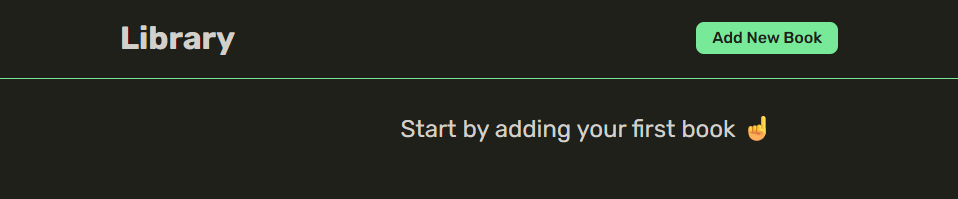
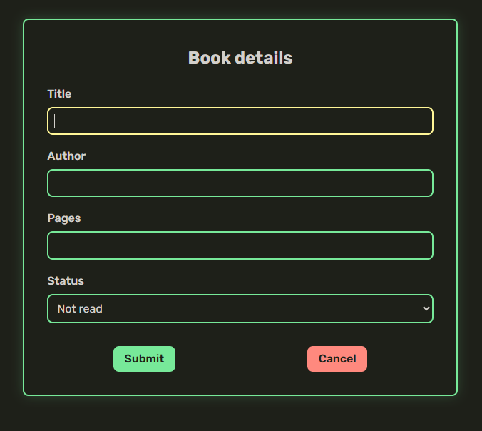
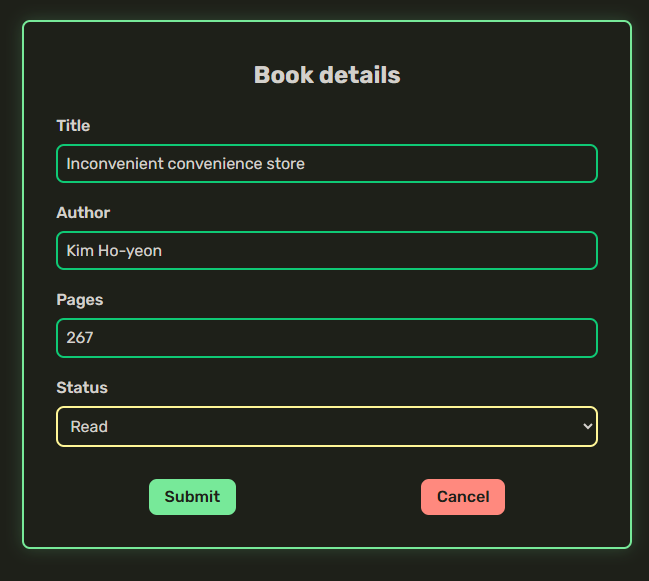
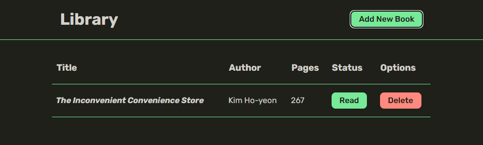

# Book library

## Purpose of the project

This project was built as part of the ["Objects and Object Constructors"](https://www.theodinproject.com/lessons/node-path-javascript-objects-and-object-constructors) lesson from [The Odin Project](https://www.theodinproject.com/) curriculum to practice:

- Object constructors and prototypes
- Prototypal inheritance
- Use of `crypto.randomUUID()`
- Separated DOM manipulation (data vs. UI rendering)
- Event handling (`event.preventDefault`, `{ once: true }`)
- Data attributes for element association
- Accessibility basics using `<dialog>`

## Built with

- HTML5
- CSS3 (with custom properties and reset)
- JavaScript (ES6+)
- DOM API

## Features

- Add new books using a form
- Store book data in an array
- Display books in a table format
- Remove books from the library
- Toggle a book’s read status

## Notes

This project is intended as a learning exercise and does not include persistent storage. All data will be lost upon page reload.
